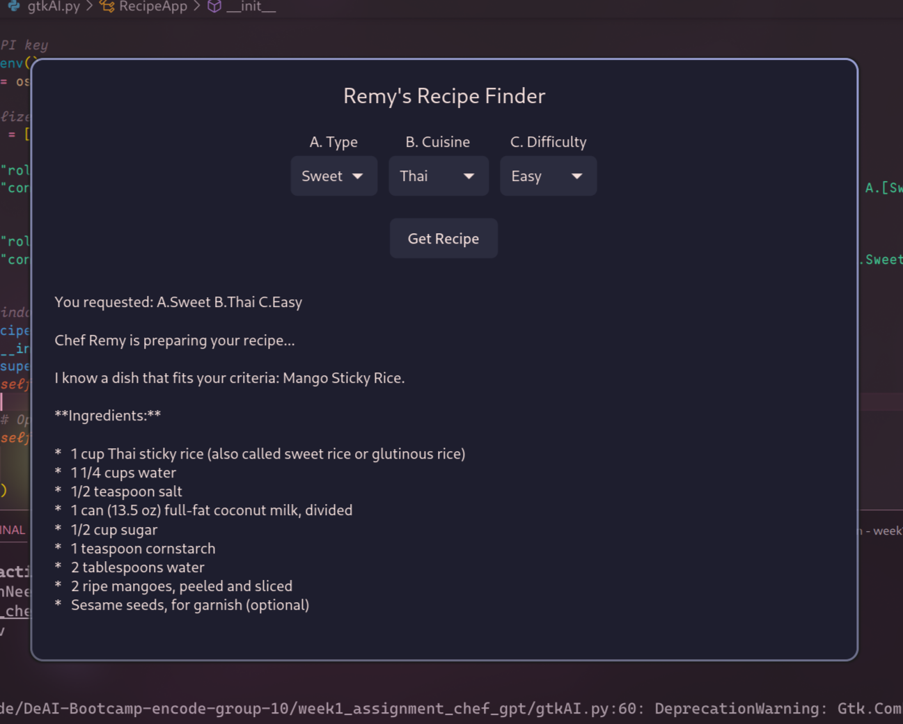
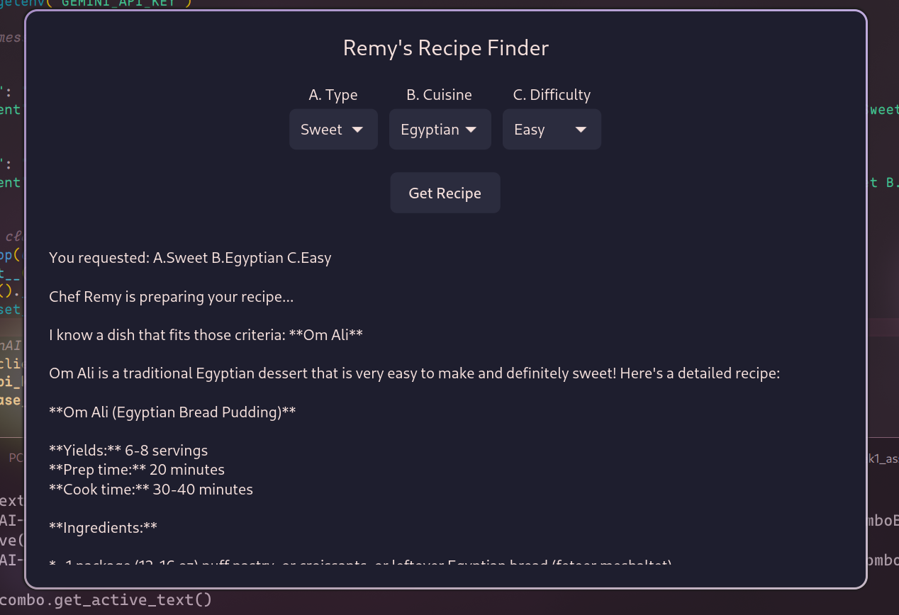

## Chef GptAI assignment for group 10
Using OpenAI python lib to interact with the gemini API
## Demo
  
  

## How to run

- Get Api from google api platform (here)[https://aistudio.google.com/app/u/2/apikey]
- Get env Example copy `cp .env.example .env`
- Open `.env` file, add `GEMINI_API_KEY= ""` variable and input your api key inside the quotes.
- Run `source venv/bin/activate` or `. venv/bin/activate` (Linux/MacOS) or `venv/Scripts/activate` (Windows) to activate the virtual environment
- Install required libs `pip3 install -requirements.txt`

- run `python app.py` or `python3 app.py`

To add your own script, create a new file with your name. for example `jonathan_iheme.py` you can use the script in app.py as a base script which you can modify to create you own custom chef-gpt.

## Authors
- 552uSd - @4undRaiser 
- sMieSb . @chris8811 
- qOsxNj - @Noor 
- GEgTJq - @Vitaly 
- woPGuH - @Marioo 
- 0VCadD - @Cengizhan Topçu
- sgO0fe - @vratesh